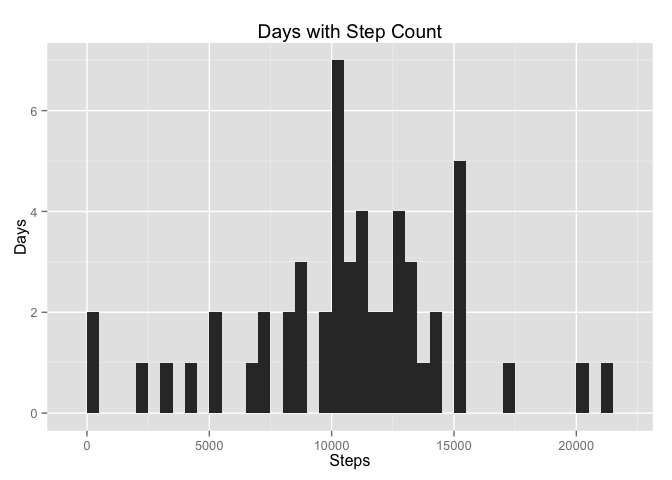
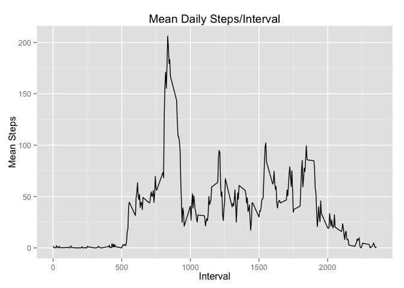
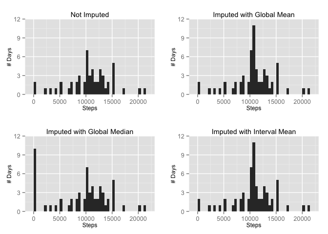

# Reproducible Research: Peer Assessment 1

Before beginning, we set the global options for the file.

```r
library('knitr')
library('ggplot2')
library('grid')
library('gridExtra')
library('xtable')

opts_chunk$set(echo=TRUE, results="asis")
```


---

## Part I: Loading and preprocessing the data

Check for the `data` directory and create it if necessary.

```r
if (!file.exists("data")) {
  dir.create("data")
}
```
This directory is ignored by git, so that we don't commit both the zipped and unzipped data.


If the zipfile exists but hasn't been extracted, extract it.

```r
if (!file.exists("data/activity.csv")) {
  unzip("activity.zip", exdir="data", overwrite=FALSE)
}
```

Read in the data from the file.

```r
data <- read.csv("data/activity.csv")
```


---

## Part II: What is mean total number of steps taken per day?

> For this part of the assignment, you can ignore the missing values in the dataset.


> Make a histogram of the total number of steps taken each day

To prepare the histogram, we first need to aggregate the steps by date.


```r
daily_steps <- aggregate(steps ~ date, data = data, sum)
```

Note that aggregate throws out the days for which there is `NA` data - there are 61 unique days in the dataset, but only 53 of them have steps logged.

Then we can produce the histogram.  Setting the bin width to 500 gives a clearer picture of the distribution.


```r
ggplot(data = daily_steps, aes(daily_steps$steps)) +
       geom_histogram(binwidth = 500) +
       ggtitle('Days with Step Count') +
       xlab('Steps') +
       ylab('Days')
```

 


> Calculate and report the mean and median total number of steps taken per day

Using the aggreated data, we can calculate the mean (rounded to two decimal places)


```r
steps_mean <- format(mean(daily_steps$steps), nsmall=2)
```

and the median


```r
steps_median <- median(daily_steps$steps)
```

and report the figures.

The mean daily step count is __10766.19__ steps per day, and the median daily step count is __10765__ steps per day.


---

## What is the average daily activity pattern?

> Make a time series plot (i.e. type = "l") of the 5-minute interval (x-axis) and the average number of steps taken, averaged across all days (y-axis)

To produce the time series plot, we first need to aggregate the data by interval.


```r
interval_mean <- aggregate(steps ~ interval, data = data, mean)
```

Then plot it as a line


```r
ggplot(data = interval_mean, aes(y = interval_mean$steps,
                                 x = interval_mean$interval)
       ) +
      geom_line() +
      ggtitle('Mean Daily Steps/Interval') +
      xlab('Interval') +
      ylab('Mean Steps')
```

 

> Which 5-minute interval, on average across all the days in the dataset, contains the maximum number of steps?

We can identify the maximum interval and see that it matches with the observations from the graph


```r
max_interval <- interval_mean[interval_mean$steps == max(interval_mean$steps), ]
```

The maximum 5-minute interval is number __835__, with an average step count of __206.1698113__.


---

## Imputing missing values

> Calculate and report the total number of missing values in the dataset (i.e. the total number of rows with NAs)

We can easily determine this by examining the original data.


```r
na_count <- length(data$steps[is.na(data$steps)])
```

There are 2304 observations where there is no step data.


> Devise a strategy for filling in all of the missing values in the dataset. The strategy does not need to be sophisticated. For example, you could use the mean/median for that day, or the mean for that 5-minute interval, etc.

Let's take a look at each of these suggestions.  We can compose a set for each, and see which one looks like it describes the data best.

> Create a new dataset that is equal to the original dataset but with the missing data filled in.

The first two cases are relatively easy, we can just calculate the mean/median per interval and use it as a replacement for the na values.


```r
global_interval_mean <- mean(data$steps, na.rm = TRUE)
data$steps_gmean <- sapply(data$steps, function(x) {
  if (is.na(x))
    global_interval_mean
  else
    x 
  })
```


```r
global_interval_median <- median(data$steps, na.rm = TRUE)
data$steps_gmedian <- sapply(data$steps, function(x) {
  if (is.na(x))
    global_interval_median
  else
    x
  })
```


The third (where we use the interval mean) is slightly more complex, but still not too bad.


```r
data$steps_imean <- sapply(seq_along(data$steps), function(x, data) {
  if (is.na(data[x, "steps"]))
    interval_mean$steps[interval_mean$interval == data[x, "interval"]] 
  else
    data[x, "steps"]
  }, data = data)
```

This leaves us with data that looks like this when there are `NA` values:


```r
xt <- xtable(head(data[is.na(data$steps), ], 10))
print(xt, type = "html", html.table.attributes = "width=100% border=0")
```

<!-- html table generated in R 3.2.2 by xtable 1.8-0 package -->
<!-- Fri Dec 18 11:03:17 2015 -->
<table width=100% border=0>
<tr> <th>  </th> <th> steps </th> <th> date </th> <th> interval </th> <th> steps_gmean </th> <th> steps_gmedian </th> <th> steps_imean </th>  </tr>
  <tr> <td align="right"> 1 </td> <td align="right">  </td> <td> 2012-10-01 </td> <td align="right">   0 </td> <td align="right"> 37.38 </td> <td align="right"> 0.00 </td> <td align="right"> 1.72 </td> </tr>
  <tr> <td align="right"> 2 </td> <td align="right">  </td> <td> 2012-10-01 </td> <td align="right">   5 </td> <td align="right"> 37.38 </td> <td align="right"> 0.00 </td> <td align="right"> 0.34 </td> </tr>
  <tr> <td align="right"> 3 </td> <td align="right">  </td> <td> 2012-10-01 </td> <td align="right">  10 </td> <td align="right"> 37.38 </td> <td align="right"> 0.00 </td> <td align="right"> 0.13 </td> </tr>
  <tr> <td align="right"> 4 </td> <td align="right">  </td> <td> 2012-10-01 </td> <td align="right">  15 </td> <td align="right"> 37.38 </td> <td align="right"> 0.00 </td> <td align="right"> 0.15 </td> </tr>
  <tr> <td align="right"> 5 </td> <td align="right">  </td> <td> 2012-10-01 </td> <td align="right">  20 </td> <td align="right"> 37.38 </td> <td align="right"> 0.00 </td> <td align="right"> 0.08 </td> </tr>
  <tr> <td align="right"> 6 </td> <td align="right">  </td> <td> 2012-10-01 </td> <td align="right">  25 </td> <td align="right"> 37.38 </td> <td align="right"> 0.00 </td> <td align="right"> 2.09 </td> </tr>
  <tr> <td align="right"> 7 </td> <td align="right">  </td> <td> 2012-10-01 </td> <td align="right">  30 </td> <td align="right"> 37.38 </td> <td align="right"> 0.00 </td> <td align="right"> 0.53 </td> </tr>
  <tr> <td align="right"> 8 </td> <td align="right">  </td> <td> 2012-10-01 </td> <td align="right">  35 </td> <td align="right"> 37.38 </td> <td align="right"> 0.00 </td> <td align="right"> 0.87 </td> </tr>
  <tr> <td align="right"> 9 </td> <td align="right">  </td> <td> 2012-10-01 </td> <td align="right">  40 </td> <td align="right"> 37.38 </td> <td align="right"> 0.00 </td> <td align="right"> 0.00 </td> </tr>
  <tr> <td align="right"> 10 </td> <td align="right">  </td> <td> 2012-10-01 </td> <td align="right">  45 </td> <td align="right"> 37.38 </td> <td align="right"> 0.00 </td> <td align="right"> 1.47 </td> </tr>
   </table>

> Make a histogram of the total number of steps taken each day and Calculate and report the mean and median total number of steps taken per day. Do these values differ from the estimates from the first part of the assignment? What is the impact of imputing missing data on the estimates of the total daily number of steps?

For the histograms, we'll need to produce the aggregate daily steps for the adjusted datasets.


```r
daily_steps_gmean <- aggregate(steps_gmean ~ date, data = data, sum)
daily_steps_gmedian <- aggregate(steps_gmedian ~ date, data = data, sum)
daily_steps_imean <- aggregate(steps_imean ~ date, data = data, sum)
```

Then we produce the plots and place them on a grid.  Note that we're pinning the y-axis using `coord_cartesian` to avoid autoscaling, so we get a clearer comparison.


```r
steps_plot <- ggplot(data = daily_steps, aes(daily_steps$steps)) +
                     geom_histogram(binwidth = 500) +
                     ggtitle('Not Imputed') +
                     xlab('Steps') +
                     ylab('# Days') +
                     coord_cartesian(ylim=c(0, 12)) +
                     theme(title = element_text(size=9),
                           axis.title = element_text(size=9))
gmean_plot <- ggplot(data = daily_steps_gmean, aes(daily_steps_gmean$steps)) +
                    geom_histogram(binwidth = 500) +
                    ggtitle('Imputed with Global Mean') +
                    xlab('Steps') +
                    ylab('# Days') +
                    coord_cartesian(ylim=c(0, 12)) +
                    theme(title = element_text(size=9),
                          axis.title = element_text(size=9))
gmedian_plot <- ggplot(data = daily_steps_gmedian, aes(daily_steps_gmedian$steps)) +
                       geom_histogram(binwidth = 500) +
                       ggtitle('Imputed with Global Median') +
                       xlab('Steps') +
                       ylab('# Days') +
                       coord_cartesian(ylim=c(0, 12)) +
                       theme(title = element_text(size=9),
                             axis.title = element_text(size=9))
imean_plot <- ggplot(data = daily_steps_imean, aes(daily_steps_imean$steps)) +
                     geom_histogram(binwidth = 500) +
                     ggtitle('Imputed with Interval Mean') +
                     xlab('Steps') +
                     ylab('# Days') +
                     coord_cartesian(ylim=c(0, 12)) +
                     theme(title = element_text(size=9),
                           axis.title = element_text(size=9))


grid.arrange(steps_plot, gmean_plot, gmedian_plot, imean_plot, ncol = 2)
```

 

We can see from observing the plots that all three methods of imputing the `NA` values add a lot more days to the histogram.  When using the global median, the majority of these end up with no steps (there must be a lot of intervals with no steps).  Both the global interval mean and the per-interval mean add more days in the middle of the histogram, which is more what might be expected.

If I were to choose one of the three methods, imputing using the daily mean for the specific interval for which data was missing would probably be the best model.


## Are there differences in activity patterns between weekdays and weekends?
